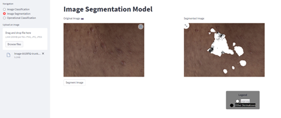
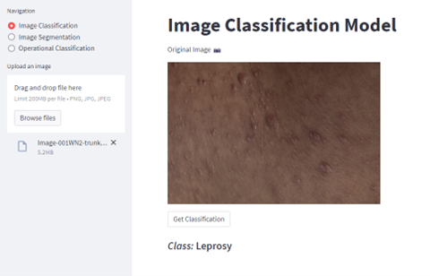
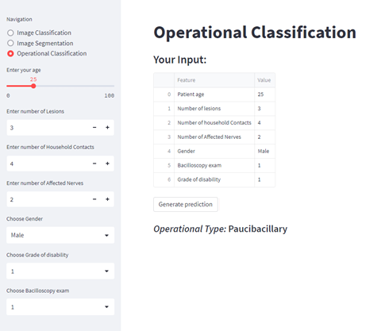

# LeproDetect
An interactive web application for Skin Image Segmentation, Leprosy Detection and Operational Classification, built with Streamlit Python Library

## Application




## Usage

Run to  download pacakges required
```
pip install -r requirments.txt
```

Run the application locally using

```
streamlit run app.py
```


